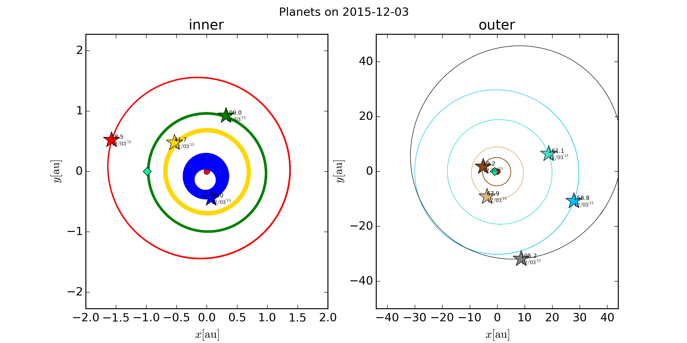
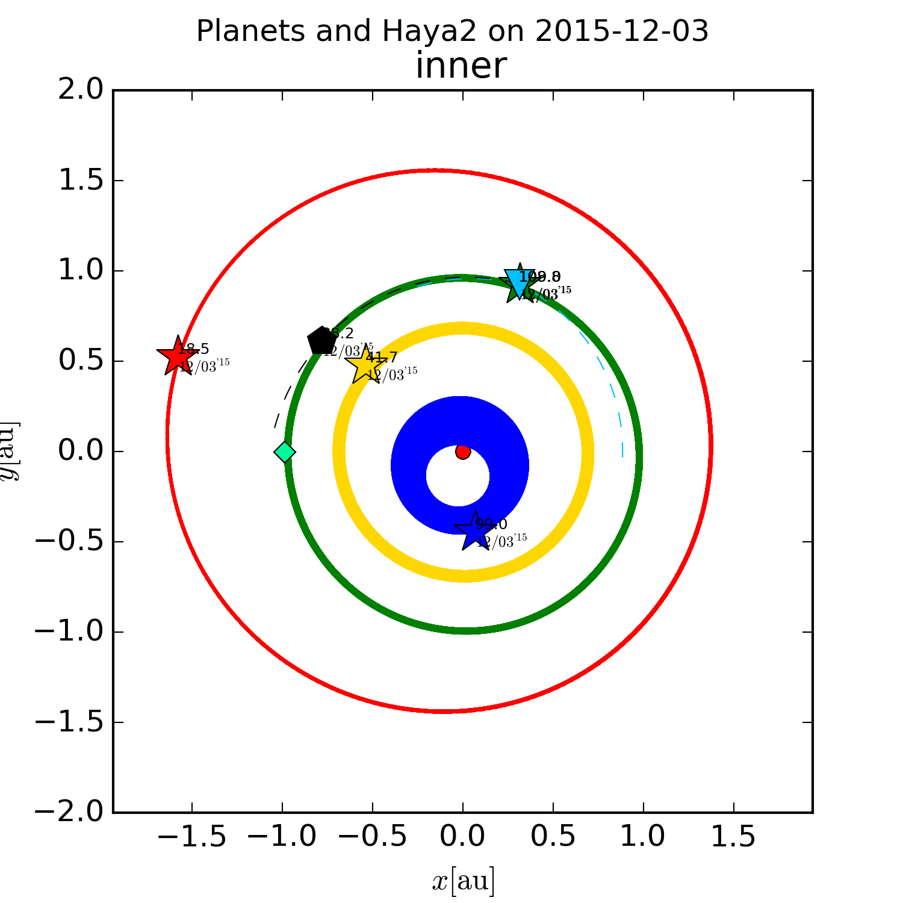

## Plot planets orbit of the Solar System

## Usage
1. clone this repositry. (i.e. `git clone http://github.com/uitspitss/planet_orbits.git`)
2. implement planet_orbits.py (i.e. `python planet_orbits.py`)
3. script create a image file into same directory

## Rrequirments
* numpy
* matplotlib
(i.e. install requirements `pip install numpy matplotlib`)

## Result

