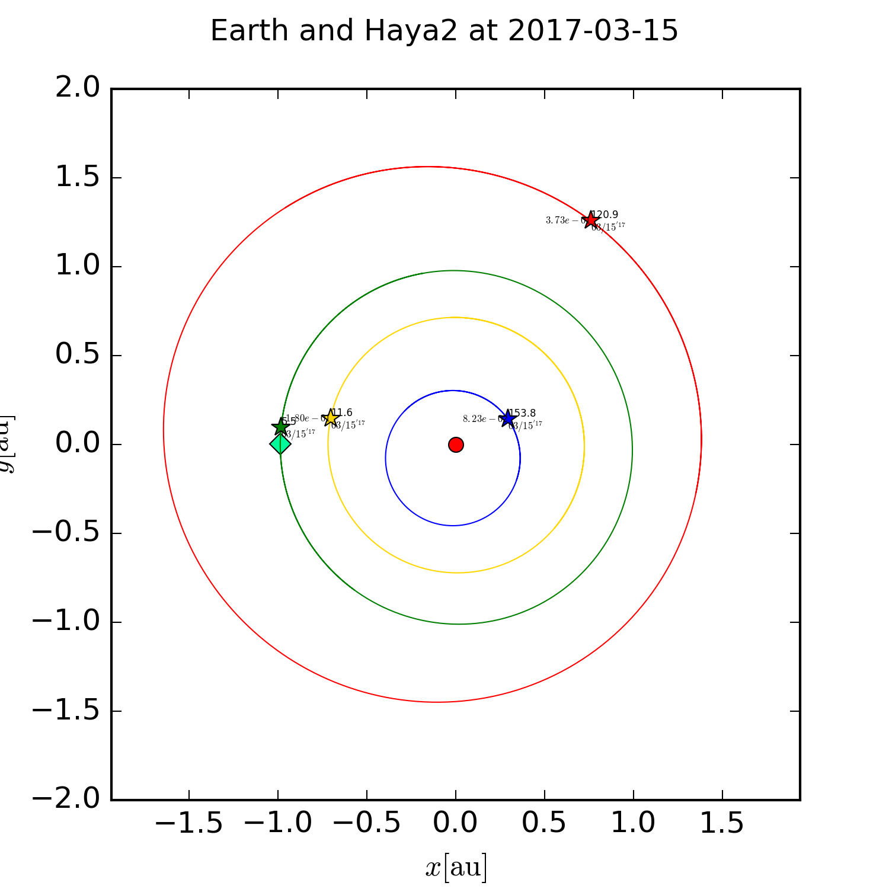
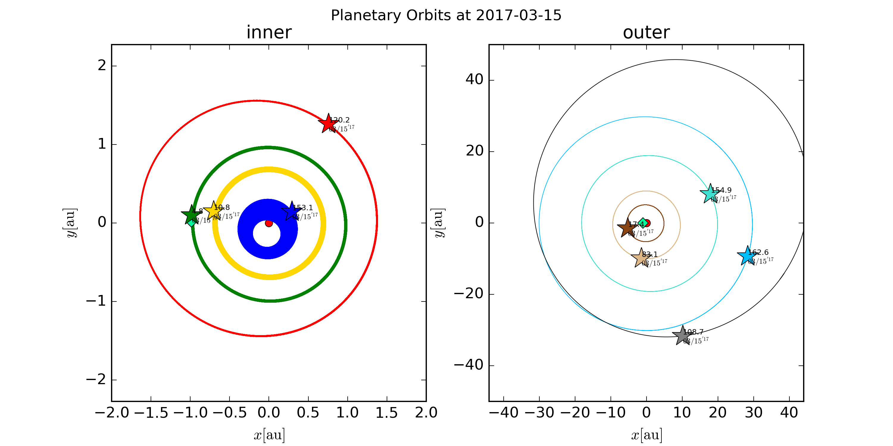
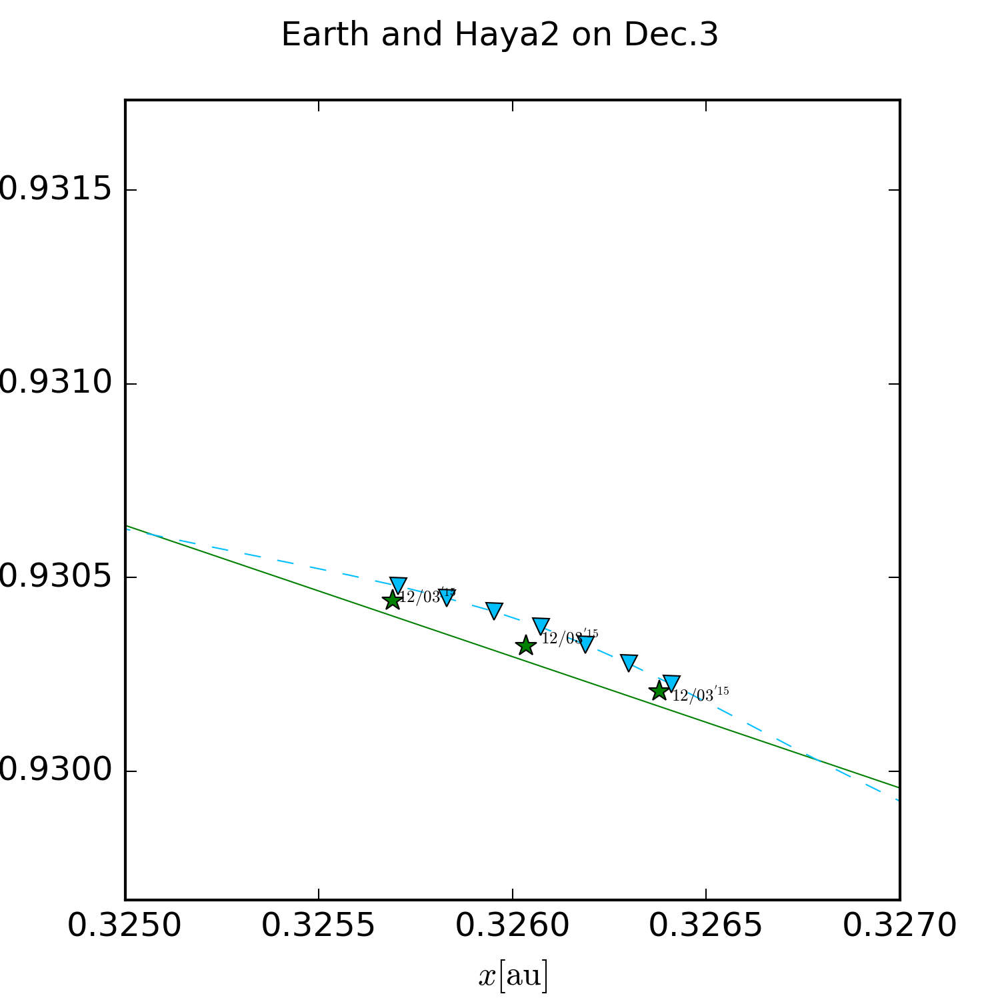

This script calculates and plots planetary orbits of the Solar System.

## Rrequirments (python library)
* numpy
* matplotlib
* dateutil

## Usage
`python planetary_orbits.py yyyy-mm-dd`

or

`python planetary_orbits_with_haya2.py yyyy-mm-dd`

then, image will be created.

## Result
result from `python planetary_orbits.py 2017-03-15`

result from `python planetary_orbits_with_haya2.py 2017-3-15`

## Accuracy
result from `python planetary_orbits_with_haya2_near.py`

